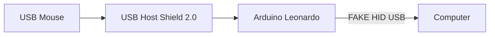

# usb-host-shield-mouse

When playing around a [USB HOST SHIELD 2.0](https://github.com/felis/USB_Host_Shield_2.0) with my Logitech G502 i've notice that examples not working with my mouse. The problem is that examples use HID Boot Protocol and G502 uses HID Report Protocol. 

# Hardware
Arduino Leonardo;
USB Host Shield 2.0;
Logitech G502;
Computer;

## What does it do?

Interpret ~~16-bit~~(actually 8-bits) data from x and y axis, mouse clicks, mouse wheel and replicate to computer.

## To Do

- Parse 16-bit precision.

## Credits

[Yukawa](https://titanwolf.org/Network/Articles/Article?AID=ee7d3b48-cb5b-49eb-83c4-e6ff634cd7d1#gsc.tab=0) - base